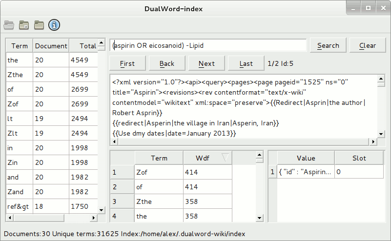

DualWord-index - cross-platform Xapian index viewer.  

With its help you can:  
 - browse documents.  
 - view and sort a list of terms.  
 - perform search using default Xapian query parser, no stemming.  

Third Party Software:  
 - Qt 4.8.6 License: LGPL v2.1  
 - Xapian 1.2.12 License: GNU General Public License  
 
License: GNU GENERAL PUBLIC LICENSE Version 3  
Source code: http://github.com/dualword/dualword-index/  

